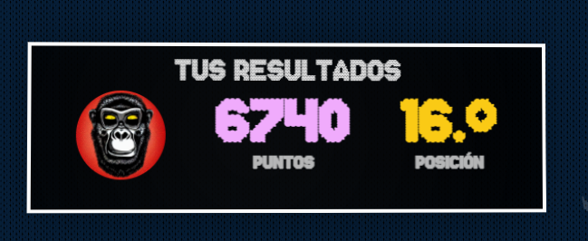

# 🎄 ADVENTJS 2023

Mis soluciones para el AdventJS 2023, dale una estrellita y sígueme en redes. Este repositorio ha sido un esfuerzo enorme. ¡Gracias! 🌟😊

## 💻 Retos

|  #  |                                       Challenge                                        | Difficulty |               Score                |
| :-: | :------------------------------------------------------------------------------------: | :------------: | :-----------------------------------: |
| 01  |                    [Reto #1: 🎁 ¡Primer regalo repetido!](/01/index.js)                    |       🟢       | 380 |
| 02  |               [Reto #2: 🏭 Ponemos en marcha la fábrica](02/index.js)                |       🟢       | 370 |
| 03  |               [Reto #3: 😏 El elfo travieso](03/index.js)               |       🟢       | 380 |
| 04  |               [Reto #4: 😵‍💫 Dale la vuelta a los paréntesis](04/index.js)               |       🟠       | 280 |
| 05  |                [Reto #5: 🛷 El CyberTruck de Santa](05/index.js)                 |       🟠       | 260 |
| 06  |                  [Reto #6: 🦌 Los renos a prueba](06/index.js)                   |       🟢       | 390 |
| 07  |                     [Reto #7: 📦 Las cajas en 3D](07/index.js)                     |       🟢       | 290 |
| 08  |                  [Reto #8: 🏬 Ordenando el almacén](08/index.js)                   |       🟠       | 290 |
| 09  |                  [Reto #9: 🚦 Alterna las luces](09/index.js)                  |       🟢       | 390 |
| 10  |                       [Reto #10: 🎄 Crea tu propio árbol de navidad](10/index.js)    |       🟢       | 290 |
| 11  |           [Reto #11: 📖 Los elfos estudiosos](11/index.js)            |       🟠       | 240 |
| 12  |              [Reto #12: 📸 ¿Es una copia válida?](12/index.js)              |       🟠       | 290 |
| 13  |                  [Reto #13: ⌚️ Calculando el tiempo](13/index.js)                  |       🟢       | 290 |
| 14  |                     [Reto #14: 🚨 Evita la alarma](14/index.js)                     |       🟠       | 390 |
| 15  |                         [Reto #15: ↔️ Robot autónomo](15/index.js)                         |       🟠       | 290 |
| 16  |                    [Reto #16: ❌ Despliegue en viernes](16/index.js)                     |       🟢       | 190 |
| 17  |            [Reto #17: 🛷 Optimizando el alquiler](17/index.js)             |       🟢       | 190 |
| 18  |                [Reto #18: 🔢 El reloj digital](18/index.js)                |       🔴       | 190 |
| 19  |                [Reto #19: 💣 Enfrenta el sabotaje](19/index.js)                |       🟠       | 190 |
| 20  |                  [Reto #20: 🏋️‍♂️ Distribuye el peso](20/index.js)                   |       🔴       | 190 |
| 21  |                      [Reto #21: 🪐 Mensaje binario](21/index.js)                      |       🟠       | 230 |
| 22  |                [Reto #22: 🚂 Lenguaje de programación](22/index.js)                |       🟢       | 260 |
| 23  | [Reto #23: 🍽️ La comida de Navidad](23/index.js) |      🟢       | 160 |
| 24  |                   [Reto #24: 🪜 Brincos en la escalera](24/index.js)                   |       🟠       | 30 |
| 25  |            [Reto #25: 🗺️ Calculando distancias](25/index.js)            |       🟠       | 290 |
